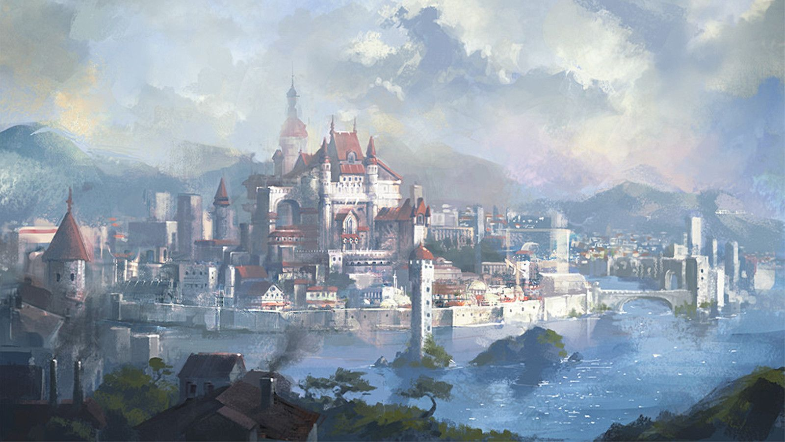
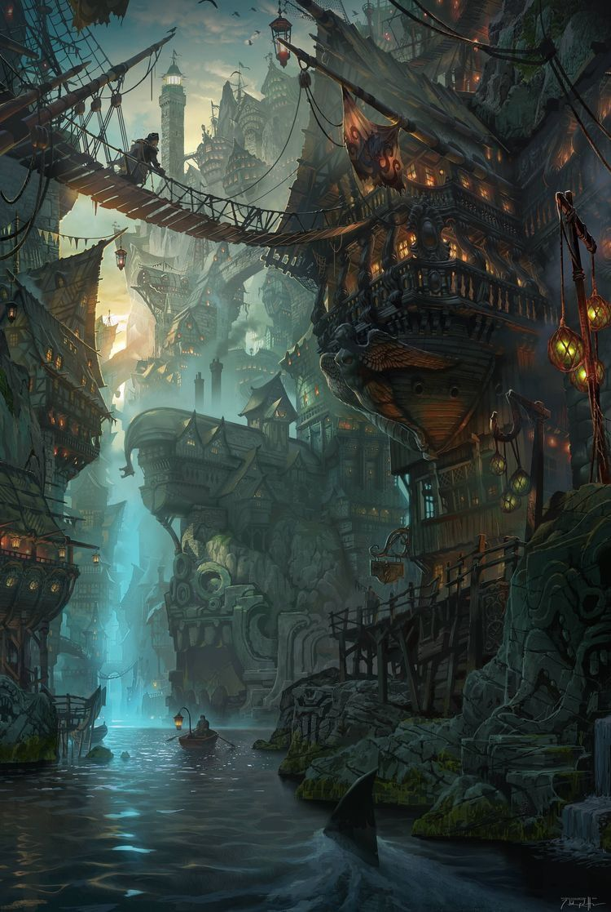
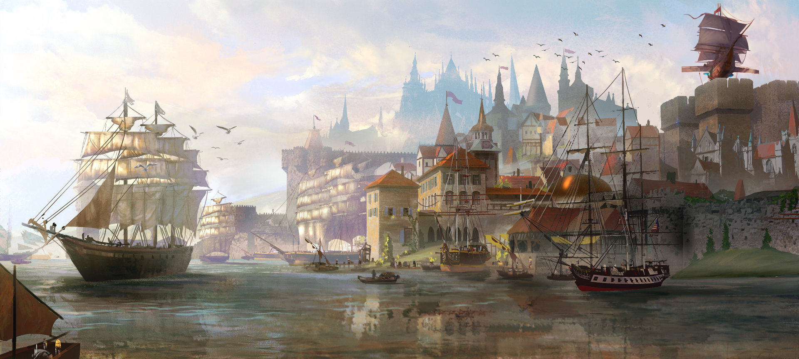
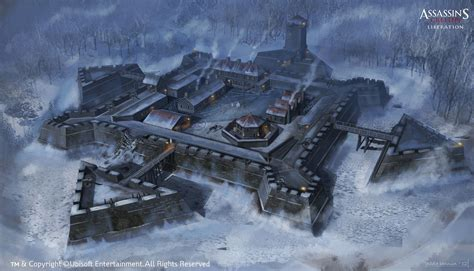
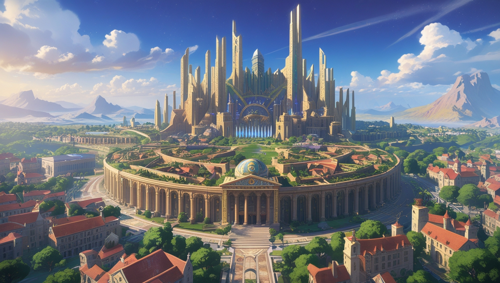
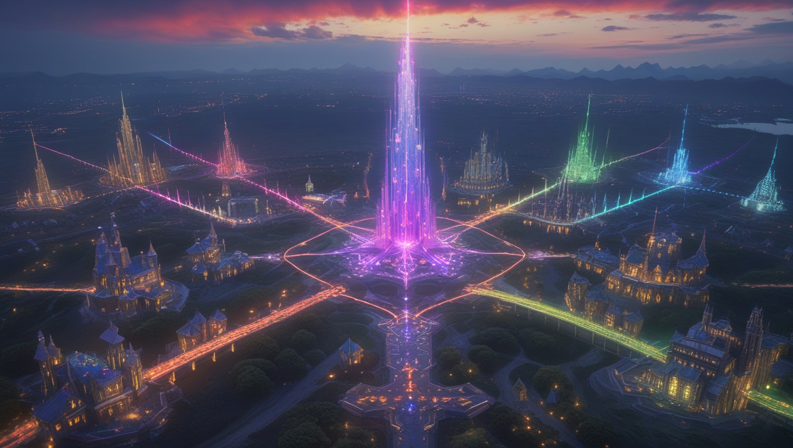
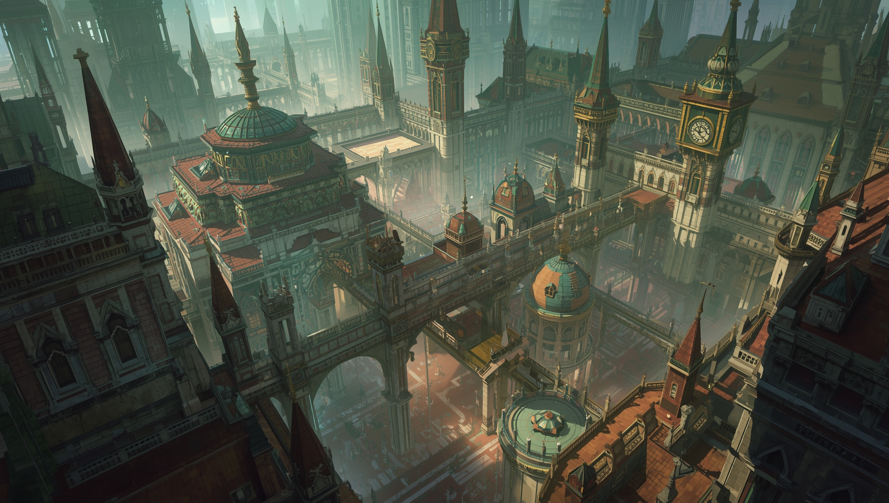
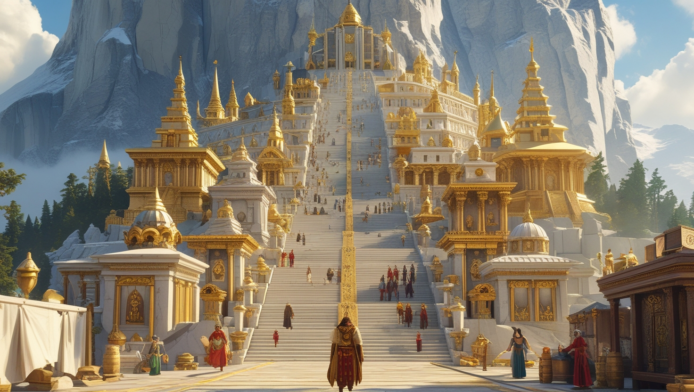
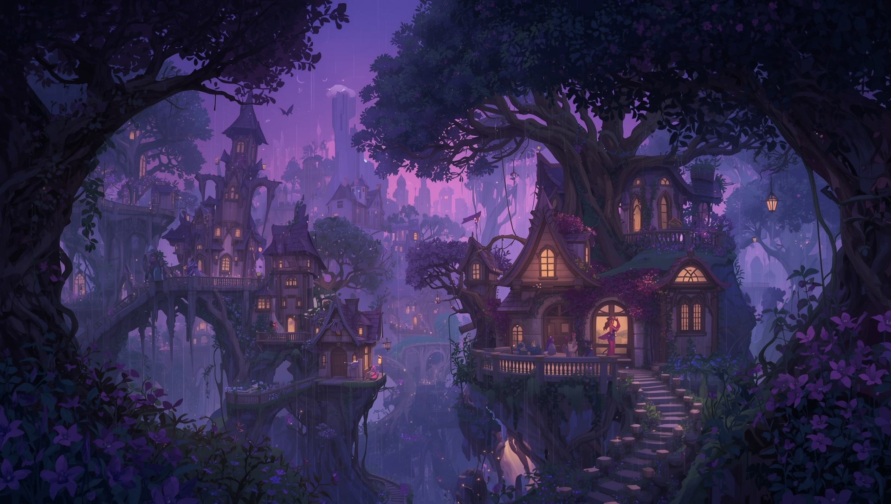
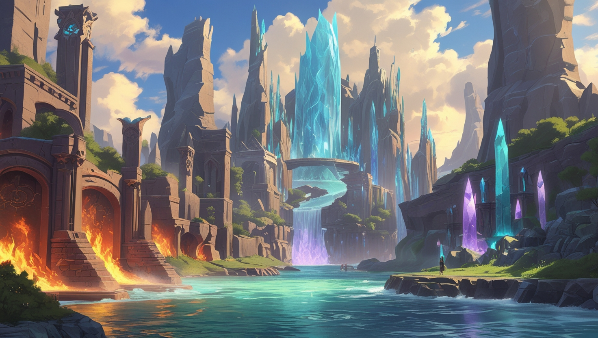

Volantis is a world currently at peace, divided between two great continents, Oryndal and Aeloris, each rich in its own unique resources. 

- Oryndal is technologically advanced, with early stages of electricity (mainly for lighting), basic firearms, steam engines, and early industrialization. While magic exists, it is rare and often distrusted.  
- Aeloris is rich in magic, featuring leyline-powered cities, enchanted forests, and divine sanctuaries. Technology is unnecessary due to magic’s abundance.  

Their vastly different cultures and ideologies create an uneasy relationship. While the continents have never fought one another, war was very common in Oryndal’s history, fueling its technological advancements.

The two continents have only recently learned of the others’ existence. Communication and trade between the two continents has been minimal, with the recent trade of Nimbus Stone (a gravity-defying mineral) and Firearms being the first major interaction between them. Nimbus Stone allows Oryndal to develop (among other things) Exoskeleton Suits for heavy lifting and Skyships, while firearms allow Aelorians without magic to more reliably defend themselves.

Skyships are extremely expensive as they require a lot of Nimbus Stone and are solely owned by the incredibly wealthy families or the major companies. The only organisation with a skyship that’s not incredibly rich is the adventurer’s guild. It was gifted by Thylen Goldmane, head of the Goldmane family, to help the guild perform its duties.

Exoskeleton Suits are nimbus powered attachments for the arms and legs that provide lifting power. They are most often seen in factories, helping the workers perform heavy lifting and the operation of heavy machinery.

## Major Cities & Culture

### Oryndal:
#### Ardenval (Oryndal’s Metropolis)

- Originally a massive military fortress, it has since grown into an industrial metropolis with a population in the millions.  
- The city's meritocratic leadership operates from the repurposed fortress, now a government and corporate hub. A large wall was later built around the city, should another war ever break out.  
- The wealthy elite live in towering spires near the fortress, the middle class reside in between the spires and the wall, while the poor live crowded in the outskirts.
#### Verrin (Port City/Trade Hub)

- A bustling port city and trade hotspot, it is the only legal gateway for commerce between Oryndal and Aeloris.
- Its sprawling docks are lined with warehouses, customs offices, and taverns catering to sailors, merchants, and smugglers alike. The harbour is constantly busy with both steamships and magically-propelled vessels.
- Trade wealth concentrates in the hands of shipping magnates who live in cliffside mansions overlooking the bay, while dockworkers crowd the cramped and noisy lower wards.
#### Dreunheim (Fortified Settlement)

- Once an impenetrable fortress guarding Oryndal’s northern frontier, it has expanded into a massive industrial city.
- The city’s towering steel walls are reinforced with trace antimagic alloys, a relic of an age when magical siege weapons were a threat. Inside, wide boulevards lead to enormous foundries, military academies, and armories.
- The military elite and weapons manufacturers dominate the inner city, while soldiers, engineers, and labourers fill the outer districts.

### Aeloris:

#### Concordia - The Unified Capital of Aeloris

- Built in the heart of Aeloris, the city is a vast, radiant metropolis where every school of magic and every type of spellcaster coexists in harmony.
- Its sprawling districts blend architectural styles and magical influences—marble temples stand beside floating crystal towers, living gardens weave through cobblestone streets, and enchanted waterways carry gondolas propelled by water elementals. The central forum, known as the Circle of Unity, is where the High Conclave meets to mediate disputes and guide the continent’s magical policy.
- In Concordia, wizards, druids, clerics, bards, sorcerers, warlocks, and more live side by side, their combined arts shaping a city where magic permeates every breath of life. While peace is maintained through mutual respect and ancient pacts, the sheer density of magical power makes Concordia a place where wonders and dangers alike are never far away.
#### Vel'Aeryn – The Arcane Nexus

- Built upon a perfect hexagon formed by intersecting leylines, the city is divided into six districts, each specialising in a distinct school of arcane magic.
- Grand towers and libraries dominate the skyline, their architecture subtly shifting to reflect the magical discipline of the district. At the heart lies the Ley Spire, where all six energies converge in a constant hum of power.
- Scholars, apprentices, and magical artisans from across Aeloris flock here, making it a hub of magical innovation and rivalry. 
#### Mirrathis – The City of Shifting Spires

- A metropolis steeped in illusion and enchantment, where both architecture and inhabitants subtly and constantly change.
- Entire districts can be unrecognisable within a week, façades ripple with shifting colours, and street layouts rearrange overnight.
- The city thrives on novelty, performance, and reinvention—though outsiders often struggle to tell reality from illusion. 
#### Seravelle – The Marble Mountain

- Perched on a sacred mountainside, the city is a shining expanse of gold and marble temples, shrines, and altars.
- The streets climb in terraces toward the summit, and it is said that each step brings you closer to the divine. Pilgrims travel from across the continent to ascend the mountain, seeking blessings or visions from the gods.
- High priests and temple guardians live near the upper sanctums, while merchants and commoners dwell in the lower terraces.
#### Thistledawn – The Fey-Touched City

- Nestled in a twilight valley, the sky here is a constant shade of violet, and the city’s buildings grow organically rather than being built.
- Its population is largely of fey descent, and wild magic surges occur without warning—most often harmlessly whimsical, but occasionally devastating.
- Music, mischief, and magic permeate daily life, but time in Thistledawn flows unpredictably for outsiders.
#### Elarion – The City of Elemental Harmony

- A rare place where the primal elements coexist in perfect balance, and elementals are known to form naturally without summoning.
- The city’s districts are shaped by their dominant element—flame-lit forges, flowing water gardens, airy spire-towers, and crystal-lined caverns.
- Its leaders act as mediators between elemental factions, ensuring the balance is never broken, for fear of catastrophic shifts in the city’s nature.
  

## Species

Oryndal is home to only a small number of species, with humans and dwarves being most common. Other species include orcs, goliaths, halflings, goblins, and bugbears.

Aeloris on the other hand has many more races, such as different kinds of fey in Thistledawn, Genasi from Elarion, Aasimar from Seravelle, and many more species with magical affinities across the continent. These include elves, gnomes, firbolg, and many animalistic species.

## Magic in Oryndal

- Magic is rare and viewed with suspicion. Most magical items are expensive imports.  
- Wizards are specialists for the elite, often hired for research or security.  
- Sorcerers are uncommon but tolerated, especially if their lineage comes from Aeloris.  
- Warlocks are despised, as their pacts suggest reliance on supernatural forces rather than human ingenuity.  
- Clerics and paladins exist but are less common, with some serving the god of life and creation and others serving the state.  

## Magic in Aeloris

- Magic is woven into daily life. Cities have streets pulsing with arcane energy, and entire forests are enchanted. The majority of the population can use magic in one way or another. The strongest magic wielders are looked up to as leaders.  
- Leyline Convergences create areas of extreme magical potency, affecting weather, time and reality itself.  
- Magical forests range from fey-touched glades to haunted woods.  
- Temples to the gods thrive, with entire cities acting as divine sanctuaries.  
- Traditional mages view technological advancement as either primitive or dangerous.  
### Cultural Perceptions Between Continents

- Oryndal sees Aeloris as inefficient and overly reliant on magic. Many believe their technology will eventually surpass magic.  
- Aeloris sees Oryndal as crude and dangerous. Some predict that rapid industrialization will be the end of Oryndal.  
- Warlocks are looked down upon in Aeloris, and completely despised in Oryndal.
## The Gods of Volantis

The gods of Volantis are engaged in a cosmic game of life and death, maintaining balance across the world. Despite them all being lawful neutral, mortals often misinterpret their true natures.
### Veylan, The Caretaker – God of Life and Beginnings

- Domains: Life, Light, Nature, Peace
- Symbol: An open hand holding a blooming flower 
- Perceived as: Lawful Good 
- Role: Ensures life flourishes, guiding growth and healing. 
- Followers: Healers, farmers, factory workers and others whose job it is to create. Most widely worshiped in Oryndal. 

### Noctare, The Custodian – Goddess of Death and Endings

- Domains: Death, Grave, Trickery, Twilight 
- Symbol: A skeletal hand cradling a dying ember 
- Perceived as: Lawful Evil 
- Role: Ensures death occurs naturally, guiding souls and preventing unnatural life extension. 
- Followers: Morticians, soldiers, mercenaries, and some priests. More openly worshiped in Aeloris.

### Valthor, The Arbiter – Keeper of Balance

- Domains: Forge, War, Tempest 
- Symbol: Scales, with one side in flames and the other in frost 
- Perceived as: Chaotic Neutral 
- Role: Intervenes to prevent life or death from gaining too much influence. May cure plagues or cull overpopulation. 
- Followers: Warriors, tacticians, and leaders who understand the necessity of difficult choices. Feared and respected in both continents. 
### Helion and Selene, The Twins – Diplomats of the Divine

- Domains: Order, Knowledge, Arcana, Peace 
- Symbol: Two interlocked rings, one silver, one gold
- Perceived as: Lawful Neutral 
- Role: Mediate disputes between gods and mortals, promoting balance through diplomacy rather than force. 
- Followers: Scholars, diplomats, and mediators. Their temples are often libraries and archives. 

## Character Concepts

### From Oryndal (Tech-Focused Society)

1. The Exiled Warlock – An Oryndal native who made a pact and is now hunted or shunned. 
2. The Scientist-Turned-Wizard – A genius student apprenticed to a foreign wizard, balancing magic and technology. 
3. The Skyship Pilot – A captain or crew member navigating the tensions between Oryndal and Aeloris.
4. The Corporate Spy – Sent to Aeloris to learn magical secrets but begins questioning their mission. 
5. The Mechanized Knight – A warrior using a Nimbus-powered exosuit, combining magic with Oryndal ingenuity. 

### From Aeloris (Magic-Dominated Society)

1. The First Artificer – A pioneer blending magic and technology, facing opposition from traditional mages. 
2. The Magicless – Born into a magical family but lacking any magic themselves, struggling for recognition. 
3. The Divine Heretic – A cleric questioning the gods’ influence, seen as a prophet or blasphemer. 
4. The Anomaly Survivor – A person altered by exposure to volatile magical energies. 

### Caught Between Both Worlds

1. The Nimbus Smuggler – A rogue or merchant illegally trading between the continents. 
2. The Hybrid Scholar – A researcher dedicated to proving that magic and technology can and should coexist. 
3. The Exiled Mage – An Aeloris native cast out for breaking magical laws, now trying to survive in Oryndal. 
4. The Riftwalker – A character who accidentally traveled between continents and is now stranded in an unfamiliar world.